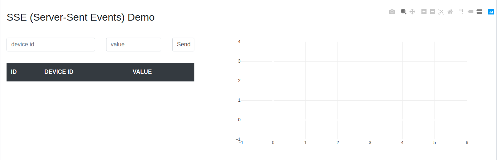

# Server Sent Events Demo  
Server-Sent Events (SSE) demo using Spring Boot and WebFlux  
Demo is working but it's still in progress  

## Requirements
1. Java 8
2. Maven
3. Git
4. MongoDB

## Installation
1. Clone repository
2. Create properties file from sample and edit it if needed:
```
cp ./src/main/resources/application.properties.sample ./src/main/resources/application.properties
```
3. Run project from root folder of application:
```
mvn spring-boot:run
```
4. Go to [**localhost:8080**](http://localhost:8080) in browser to see home page of application

## How to use
On a home page you will see something like this:  
  
You can fill from with device ID and value and press Send. It will send data you entered to server.  
Then it will save that data to database and push event to all active clients.  
On the same page you will see results on table and chart.  
Try to open it in many browser windows/tabs. It will push events to all of them.  

For other examples see:  
[http://localhost:8080/api/secured/time](http://localhost:8080/api/secured/time)  
[http://localhost:8080/api/secured/metric/all](http://localhost:8080/api/secured/metric/all)  
[http://localhost:8080/api/secured/metric/stream](http://localhost:8080/api/secured/metric/stream)  
[http://localhost:8080/api/secured/metric/sse](http://localhost:8080/api/secured/metric/sse)  

## See also
https://www.baeldung.com/spring-server-sent-events  
https://www.mkyong.com/spring-boot/spring-boot-webflux-server-sent-events-example
https://thepracticaldeveloper.com/2017/11/04/full-reactive-stack-with-spring-webflux-and-angularjs  
https://www.baeldung.com/spring-data-mongodb-reactive  
https://rfvallina.com/blog/2017/08/14/server-sent-events-with-spring-framework-part-II.html  
